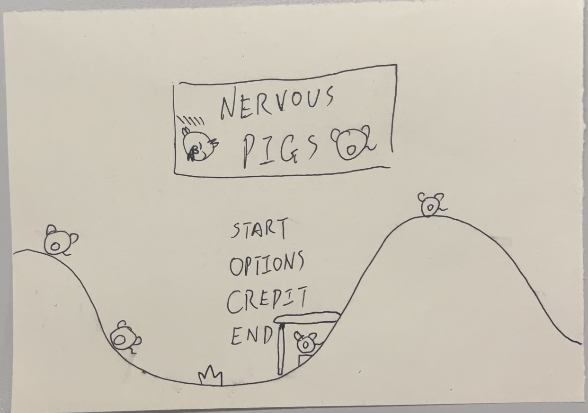
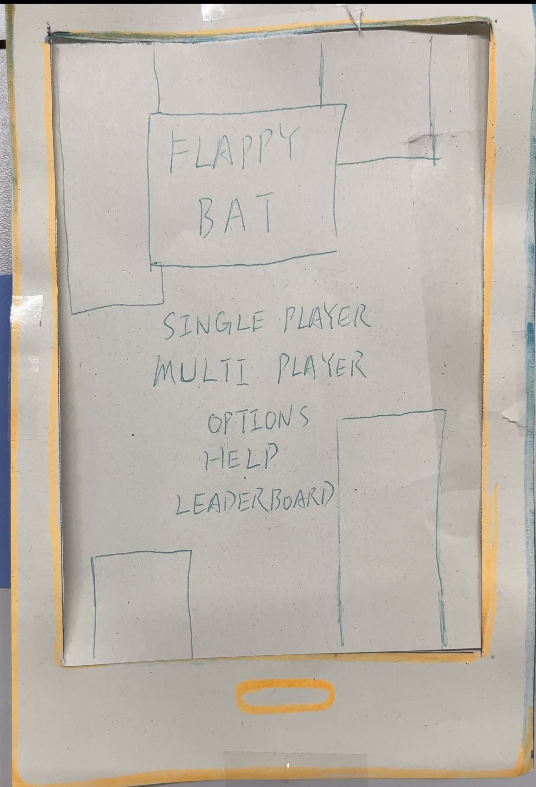

# Group 20 Team Photo

# Members
Klaudia Żymełka, ex23530@bristol.ac.uk, klaudz9

Ziang Zhang, ma23462@bristol.ac.uk, Zazhang3

Kelvin Lu, rl17487@bristol.ac.uk, LurchK

Yiding Chen, vf23652@bristol.ac.uk, Ch1eti

# Final Game
 -> Nervous Pigs 
+ twist: The game was inspired by a well-known game where birds try to kill green pigs. In our version, the roles are reversed and the player is in charge of building a structure that can protect the pigs.
+ challenges: implementing real-life physics in the game so that all elements of the game are affected by it, making the levels different and increasingly hard, implementing of the highest scores page for all users   
+ Paper prototype:
    

# Previous Game ideas
-> Snake 
+ twist: two snakes
+ challenges: detect collisions, snake movement, trails logic

-> flappy bat 
+ twist: you don't see the whole map just the area around the bat (ultrasound)
+ challenges: radar, map generation, moving pipes or two players

-> space invaders 
+ twist: we're the aliens invading
+ challenge: enemy movement, making barriers that lose life, shooting system

-> doodle jump 
+ twist: multi player 
+ challenge: multi-player game, different objects to collect which have functions, map generation

# Other Paper Prototypes
## Flappy Bat

# Requirements
## Stakeholders
+ players
+ developers (our team)
+ markers (teachers)

## User Stories
+ As a player I want to protect the pigs the best I can so that I get a high score.
+ As a player I want to get a high score in order to be the best at the game.
+ As a player I want to be informed how to play in order for me to be able to enjoy the gameplay.
+ As a developer I want to have a clear idea of what I am expected to implement to be able to deliver the best code.
+ As a developer I want to have a clear idea of what I am expected to implement to find the task enjoyable.
+ As a marker I want to see clear documentation so I can mark the game fairly and accurately.

## Use-case Specifications
Viewing the scoreboard
>  Description: The player starts the game and wants to see the scoreboard.
>
> Basic Flow:
> 1) When a user starts the game main menu opens with options to select from.
> 2) The user uses a mouse or touchpad to click on the "Scoreboard" button.
> 3) A new page is opened with the top 5 players (their names) and the scores they achieved.
> 4) To return to the main menu the user clicks on the "Return" button.

Start A Game
> Description: The player wants to start a game.
>
> Basic Flow:
> 1) The user is back to the main menu.
> 2) The user uses a mouse or touchpad to click on the "Start" button.
> 3) The user is asked to enter the name which will be then displayed on the scoreboard page if the score achieved is high enough.
> 4) The user uses the keyboard to enter the name and clicks enter to confirm that the name was entered. 
> 5) The user is displayed a 'building screen'.

Building Shelter for Pigs
> Description: In the first stage of the game the player is asked to build a structure to protect the pigs.
>
> Basic Flow:
> 1) The user is in the 'building screen'.
> 2) The player uses buttons representing different materials (e.g. wood, steel) to build a structure that won't collapse. (The player has a budget for this task)
> 3) The player uses a button to place n amount of pigs on the screen (n is different for different levels and the user can't start the game without placing all of the required pigs)
> 4) The user clicks on the "Start" button.
>
> Alternative Flow: 
> 1) The user is in the 'building screen'.
> 2) The player uses a button to place n amount of pigs on the screen (n is different for different levels and the user can't start the game without placing all of the required pigs)
> 3) The player uses buttons representing different materials (e.g. wood, steel) to build a structure that won't collapse. (The player has a budget for this task)
> 4) The user clicks on the "Start" button.

Birds Attack
> Description: In the second stage of the game the player does nothing but watch the events happening.
>
> Basic Flow: Player Wins
> 1) Birds start falling.
> 2) Materials get damaged.
> 3) At least one pig survives the attack.
> 4) Points are calculated (points are given for the amount of budget left and amount of pigs that survived)
> 5) The "Win" screen is displayed with the current score.
>
> Alternative Flow: Player Loses
> 1) Birds start falling.
> 2) Materials get damaged.
> 3) All pigs are killed.
> 4) Points are calculated (points are given for the amount of budget left and amount of pigs that survived)
> 5) A "Loose" screen is displayed with the final score.

Win Screen
> Description: When a user wins a level they are displayed a "win" screen.
>
> Basic Flow: The player won level 1 or level 2.
> 1) Player can see their current score displayed on the screen.
> 2) There is one button on the screen -> "Next Level" button that needs to be pressed in order to continue.
>
> Alternative Flow: The player won level 3 which is the last level in the game.
> 1) Player can see their current score displayed on the screen.
> 2) There is one button on the screen -> "End Game" button that needs to be pressed to display the main menu.

Loose Screen
> Description: When a user loses a level they are displayed a "loose" screen.
>
> Basic Flow: 
> 1) Player can see their final score displayed on the screen.
> 2) There is one button on the screen -> "Return" button that needs to be pressed to display the main menu.

Exit Game
> Description: The player wants to exit the game after finishing the game.
>
> Basic Flow:
> 1) The user is back to the main menu.
> 2) The user uses a mouse or touchpad to click on the "Scoreboard" button.
> 3) A new page is opened with the top 5 players (their names) and the scores they achieved.
> 4) To return to the main menu the user clicks on the "Return" button.

## Case-use Diagram

## Reflections 
The most beneficial for the group turned out to be the exercises that required us to create a user-case diagram and user-case specifications. After creating the paper prototype of the game we knew that everyone had the same idea about how the game would look like and what needed to be implemented. However, it turned out we didn't think deeply enough about some of the game elements. For example, we did not discuss how the points would be calculated. In order to find the scenario that would allow for achieving a wide range of scores we changed some of the initial ideas. Now pigs instead of being placed by the player would stay on the ground and only one pig remaining after the birds' attack would be enough to move to another level. The amount of pig that would stay alive at the end of the level would impact the score. Another element that we realised was that we didn't discuss in what way the levels would become harder and harder.  

## How To Play
1) First you need to download the Processing development environment for the game from the following link: [download here](https://processing.org/download).
2) Download the above GitHub repository that contains the game program as a ZIP file and extract it.
3) Open the extracted folder and open the Game.pde which can be found in: Game -> Code. By doing so, Processing should be up and running.
4) In Processing go to: Tools -> Manage Tools… -> Libraries. Install the following libraries: javafx, sound 
5) Press the play button in the left upper corner of the Processing window in order to play!
