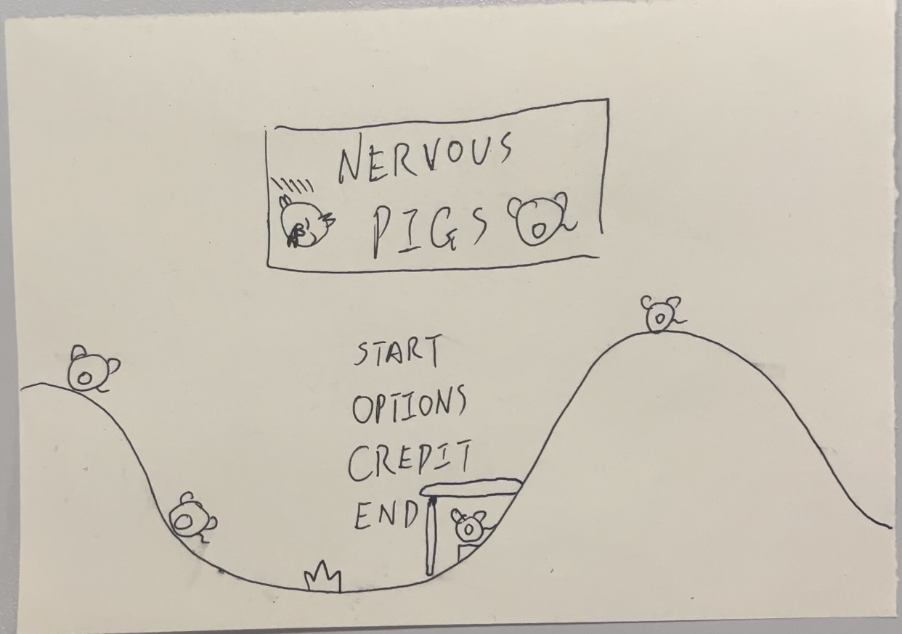
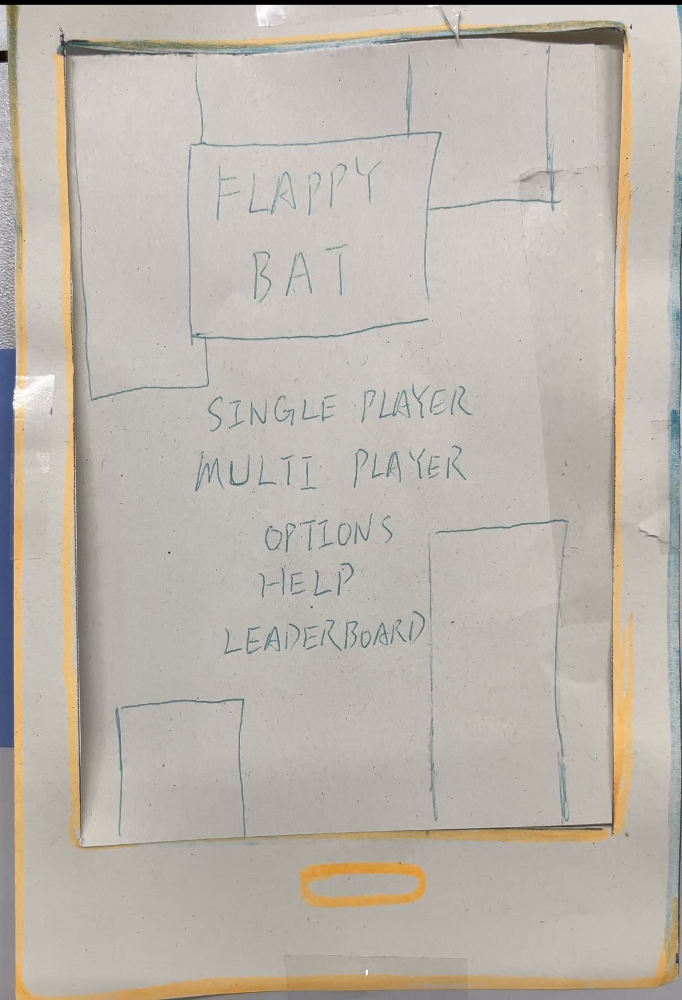

# Group 20 Team Photo

# Members
Klaudia Żymełka, ex23530@bristol.ac.uk, klaudz9

Nishtha Singh, ga23124@bristol.ac.uk, ananishtha98

Ziang Zhang, ma23462@bristol.ac.uk, Zazhang3

Kelvin Lu, rl17487@bristol.ac.uk, LurchK

Yiding Chen, vf23652@bristol.ac.uk, Ch1eti

# Final Game
 -> Nervous Pigs 
    twist: The game was inspired by a well-known game where birds try to kill green pigs. In our version, the roles are reversed and the player is in charge of building a structure that can protect the pigs.
    challenges: implementing real-life physics in the game so that all elements of the game are affected by it, making the levels different and increasingly hard, implementing of the highest scores page for all users   
    Paper prototype:
    

# Previous Game ideas
-> Snake 
    twist: two snakes
    challenges: detect collisions, snake movement, trails logic

-> flappy bat 
    twist: you don't see the whole map just the area around the bat (ultrasound)
    challenges: radar, map generation, moving pipes or two players

-> space invaders 
    twist: we're the aliens invading
    challenge: enemy movement, making barriers that lose life, shooting system

-> doodle jump 
    twist: multi player 
    challenge: multi-player game, different objects to collect which have functions, map generation

# Other Paper Prototypes
## Flappy Bat

# Requirements
