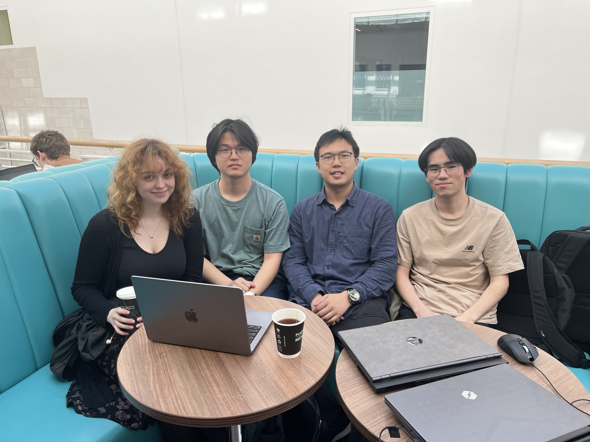

<figure align="center">
  
  <figcaption align="center"><a href="https://youtu.be/Fx1-8QmGgEU">Link to "Anxious Pigs" trailer.</a></figcaption>
</figure>

# Table of Contents
- [Team](#team)
- [Introduction](#introduction)
- [Requirements](#requirements)
  - [Early Stages Design](#early-stages-design)
  - [Use Case Stories and Use Case Diagram](#user-case-stories-and-use-case-diagram)
- [Design](#design)
  - [Physics Engine](#physics-engine)
  - [Game](#game)
- [Implementation](#implementation)
  - [Physics Engine](#physics-engine)
  - [Level Generation](#level-generation)
  - [Performance Optimisation](#performance-optimisation)
- [Evaluation](#evaluation)
  - [Qualitative Evaluation](#qualitative-evaluation)
  - [Quantitative Evaluation](#quantitative-evaluation)
  - [Testing](#testing)
- [Process](#process)
  - [GitHub](#github)
  - [Kanban Board](#kanban-board)
  - [Microsoft Teams](#microsoft-teams)
- [Conclusion](#concludion)
- [Individual Contributions](#individual-contributions)
- [How to Play](#how-to-play)

# Team

<figure align="center">
  
  <figcaption><i>Group photo.</i></figcaption>
</figure>

<table align="center">
    <thread>
        <tr>
            <th style="text-aligh:centre">Name</th>
            <th style="text-aligh:centre">Email</th>
            <th style="text-aligh:centre">GitHub Name</th>
        </tr>
    </thread>
    <tbody>
        <tr>
            <th style="text-aligh:centre">Yiding Chen</th>
            <th style="text-aligh:centre">vf23652@bristol.ac.uk</th>
            <th style="text-aligh:centre">Ch1eti</th>
        </tr>
        <tr>
            <th style="text-aligh:centre">Kelvin Lu</th>
            <th style="text-aligh:centre">rl17487@bristol.ac.uk</th>
            <th style="text-aligh:centre">LurchK</th>
        </tr>
        <tr>
            <th style="text-aligh:centre">Ziang Zhang</th>
            <th style="text-aligh:centre">ma23462@bristol.ac.uk</th>
            <th style="text-aligh:centre">Zazhang3</th>
        </tr>
        <tr>
            <th style="text-aligh:centre">Klaudia Żymełka</th>
            <th style="text-aligh:centre">ex23530@bristol.ac.uk</th>
            <th style="text-aligh:centre">klaudz9</th>
        </tr>
    </tbody>
</table>

# Introduction

Our project is based on the famous 2010s game, Angry Birds. In the original game, the player would shoot birds with the slingshot to kill pigs which were protected by different structures. In our version called Anxious Pigs players act as protectors, taking the quest from the Pig King to help the pigs survive the attacks.   

Players have a budget that they can spend on buying basic materials like glass, wood and stone. Those materials can be used to build strong structures shielding pigs from upcoming attacks. Cheaper structures are less resilient but if used creatively they can be game-changing.   

Attacks come in three waves and are conducted by three types of birds with different abilities. Red birds don’t have any superpowers. Purple birds can reverse gravity upon the first object they collide with. Black birds can explode, destroying the players’ carefully built structures in an instant!   

Find out why pigs became so anxious, discover the most efficient ways to protect pigs, compare your score to other players included in the ‘Best Pig Protector’ ranking and become the next Pig King!   

<figure align="center">
  
  <figcaption><i>Demonstration of a gameplay.</i></figcaption>
</figure>

 

All of the art included in the game was drawn by one of the members in a free software Krita (except for the background which was generated with the AI image generator DALL-E).   

As a team, we believe we successfully managed to implement the game we envisioned. Good luck protecting all the pigs and remember the Pig King counts on you! 

# Requirements

The game development started with the whole team having an in-person brainstorming meeting. The session was divided into two parts. In the first one, everyone shared their expectations towards the project and the type of game we were supposed to develop. We agreed that we wanted our game: 

<lu>
  <li>To be challenging for us to develop.</li>
  <li>To be more of a logic-based game.</li>
  <li>To consist of levels with increasing difficulty.  </li>
</lu>
 
During the second part of the meeting, we came up with 5 different game ideas: Snake, Flappy Bat, Space Invaders, Doodle Jumps and Anxious Pigs. 

Our team's ideation process was dynamic. During many meetings, we analysed the novelty, interest, and technical challenges of each idea, and then assessed whether the game was feasible. Finally, the team decided to move to the paper prototype stage with Anxious Pigs and Flappy Bat. Those two ideas were chosen because: 

<lu>
  <li>Snake and Doodle Jump games were not challenging enough to develop in our opinion.</li>
  <li>Space Invaders was more of a dexterity game than a logic game.</li>
  <li>The chosen games seemed to have the most original twist ideas.</li>
</lu>

## Early Stages Design 
After choosing two games, the team decided to concentrate on creating user stories. This allowed us to analyse users' needs clearly and additionally to decide on the game's most crucial elements. The process helped us to further lay the foundation of what we wanted to achieve with our game. 

Main User stories from the game the team ended up choosing: 
+ As a player I want to protect the pigs the best I can so that I get satisfaction from winning.
+ As a player I want to get a high score and to be the best at the game. 
+ As a player I want to be informed about how to play in order for me to be able to enjoy the gameplay.
+ As a developer I want to have a clear idea of what I am expected to implement to be able to deliver the best code.
+ As a developer I want to have a clear idea of what I am expected to implement to find the task enjoyable.
+ As a developer I want to have a clear idea of what I am expected to implement to find the task enjoyable.

To unify the team's vision of the games, we created paper prototypes representing basic ideas for the gameplay. 

During the process, the team further discussed the nuances of the chosen games. Based on this, we compared the two ideas again and concluded that Anxious Pigs would be more creative and challenging. Team members also seemed to resonate more with the game's themes. The following main idea of the game was finished:

<lu>
  <li>The player would have to protect pigs by spending money to purchase materials to build structures shielding pigs.</li>
  <li>The player would have to protect pigs by spending money to purchase materials to build structures shielding pigs.</li>
  <li>After the birds’ attacks, if there was at least one pig left, the player would proceed to the next level.</li>
</lu>

## Use Case Specifications and Use Case Diagram

The system architecture of our game can be separated into two parts, the physics engine and the game. 
After that, we had to decide on the core mechanics that needed to be implemented. We created use-case stories which are essential for refining and visualising the interactions of in-game features. The main Use-case Specifications include the following sections: 

+ Viewing the scoreboard: The player wants to view the scoreboard. 
+ Start A Game: The player selects "Start" and enters a name. 
+ Building Shelter for Pigs: The player is forced to choose and place materials to protect pigs with a limited budget. 
+ Birds’ Attack: The game code handles this phase automatically and the player can only observe the results of the attack. 
+ Score: calculated based on difficulty level, budget left and the number of successfully protected pigs. 
+ Win Screen and Lose Screen: Display the results of the player's game. 
+ Exit Game: The player wants to exit the game after finishing the game. 

These Specifications describe the basic flow of the game and more detailed use case specifications can be viewed <a href="OrganisationFiles\UseCaseDiagram\UseCaseSpecifications.docx">here</a>. 
The final Use Case diagram was as follows:

<figure align="center">
  
  <figcaption><i>Use case diagram.</i></figcaption>
</figure>

 
All of the creative decisions were made by the whole team and we made sure that everyone had a chance to voice their concerns and ideas. The most challenging part of the ideation process was making the decisions. The team came up with a lot of good ideas and thus initially we had trouble choosing only one. However, by following the agile development techniques all the decisions made had good reasons behind them which allowed the team to be much more confident in the final game choice. 

# Design

The system architecture of our game can be separated into two parts, the physics engine and the game.  

## Physics Enqine

The physics engine comprises the classes World, Rigidbody, Circle and Rectangle, where Circle and Rectangle are extended from Rigidbody. 

<figure align="center">
  
  <figcaption><i>Physics engine class diagram.</i></figcaption>
</figure>

 

The RigidBody class contains the general properties that a rigid body holds like for example mass or position. Some of the most important methods are the ones to update the velocity and location of the body given a duration of time step, and a method which resolves a collision between two bodies given the collision information. 

The Circle and Rectangle classes include some more specific properties of their bodies, as well as methods from a visitor pattern to detect if two bodies are in contact with each other. If two bodies are detected to be in contact, then the resolve collisions method in the Rigidbody class will be called to resolve it.  

The World class is there to help organize the bodies which are to be physically interacting with each other. Its attributes include a list to keep track of the bodies, the values of the gravity as well as velocity drag. The class also contains methods which are used to alter the list of bodies, check and resolve collisions between the bodies, update their status given a duration of time step, and display the bodies.

## Game

As users interact with the game mainly by clicking buttons on the screen, the ImageButton class was defined. It solved two encountered issues of code repetition and human error when defining the button area. 
The ScreenManager class was created to optimise managing different screens of the game. The class stores all the available screens into a variable, keeps track of which screen is currently displayed and has the current player information.

<figure align="center">
  
  <figcaption><i>Game class diagram.</i></figcaption>
</figure>

 

The game has seven different screens with each of them being a separate class extending the abstract Screen class. The Screen class defines abstract methods responsible for display and user input handling.
The StartScreen class creates the initial interface of the game also called the main menu. 
PlayerNameScreen class allows user to enter their name.  
The Player class stores information about the current user of the game like the player’s name, score and the selected difficulty level. The most important methods are responsible for deleting the player information, automated score calculation and updating the external file that stores users' scores. The Player class instance is saved in the ScreenManager and passed to relevant Screen objects.
DifficultyScreen allows the player to select between two difficulty levels and saves the information in the Player class.
The GameScreen is responsible for the screen of core gameplay. The class initialises a Level object based on the current level number and selected difficulty. In order to allow user interactions with the current level, the GameScreen class calls Level class methods in its own functions. The class is also responsible for printing out the player's name, current score and the current level.
The Level class contains all the level information loaded from a JSON file. For easy levels, bird attack directions are the same as in the read JSON files however, for hard levels those directions are randomised to introduce an element of challenge. All the objects are loaded as a list object to the newly instantiated World object responsible for executing physics engine methods.
The Tutorial class together with the Menu class were designed to display a series of texts guiding the player during their first gameplay. The Tutorial class constructs a list of Menu objects in classes inheriting from Screen with any text. 
Bird and Pig classes extend from the Circle class and thus can be treated by the physics engine as a circular elements. 
BirdRed, BirdPurple and BirdBlack extend the Bird class and implement methods responsible for birds' super abilities (excluding red bird).
The Material class was extended from the Rectangle class. It describes the basic method that all materials have: detect whether the mouse is on a material, highlight the selected material and an abstract display method to be implemented by subclasses. The Glass, Stone and Wood classes inherit from the Material classes and have different attributes.
The WinScreen and LoseScreen classes act as a cue for the game's end. They would display information about the game result and the score the player achieved. Both screens also implement a button that allows the player to return to the main menu.
The ScoreScreen class was designed to display the top players’ names and their scores. The most important class method loads the table files to the data structures and prints them to the screen. 

<figure align="center">
  
  <figcaption><i>Class diagram.</i></figcaption>
</figure>

 

<figure align="center">
  
  <figcaption><i>Behaviour diagram.</i></figcaption>
</figure>

# Implementation

A number of challenges were encountered while developing the game however three stand out the most: the physics engine, the level generation and the optimisation of the game. 

## Physics Engine

The physics engine can be broken down into three parts, contact detection, collision resolution, and engine incorporation into the game. The former two were done mostly by following a tutorial of building a C# physics engine on YouTube by a programmer whose account name is Two Bit Coding. We followed the ideas and did some performance optimisation along the way  when writing our Java version. 

### Collision Detection

To detect if two circles are in contact with each other, their positions and radii are analysed. If the distance between their centres is less than the sum of their radii, they are in contact with each other, and the forcing direction is defined by vector subtraction of one’s position to the other. To detect if a polygon is in contact with another shape, the Separating Axis Theorem was used. The theorem is stated as the following analogy, for each side of each body, we shine a light source that is parallel to the side, to both bodies, then if there is a gap between the shadows of the bodies, it proves that they are separated. On the other hand, if there is no gap at all, then the bodies are in collision with each other, where the shortest penetration of shadows hints at the forcing direction. 

### Collision Resolution

Once the collision occurs and the force direction is determined an equation number 9 from the <a href="https://chrishecker.com/images/e/e7/Gdmphys3.pdf">articel by Chris Hecker</a> is used to resolve the collision.

Above equation was also used to calculate friction that occurs during the collision. Thanks to that body slows down as it’s velocity decreases until it reaches zero. 

### Incorporation with the game 

Each bird, pig and material had a maximum momentum value assigned. That value would be compared with a variable extending from a RigidBody class which stores the maximum momentum that the body has ever experienced. If the experienced momentum is greater than the assigned threshold the entity will be killed.  

In order to implement birds' superpowers a new variable was created in RigidBody which would have assigned to it the last object that the body was in contact with. This allowed us to determine if a collision happened with the ground, material, bird or a pig. 

For purple birds, a variable was created which would remember the body's acceleration which would then be used to inverse gravity upon the first touch object. 

When a black bird collides with something a list of objects within a certain radius away from it is created. On each of those bodies, an impulse is then exerted with a value corresponding to the distance to the black bird. 

## Level Generation

To enable a more versatile way of designing and storing the levels, JSON files were used. Each level would be described by one JSON file which contains an array of JSON objects. Each object represents an element of the level and its first attribute is a String corresponding to a class present in the game. The rest of the attributes correspond to for example position on a screen, rotation or size. 

To demonstrate it, the following attributes would be needed to define a red bird: 

+ "type": "BirdRed" 
+ "positionX": 0.2 
+ "positionY": 0.1 
+ "velocityX": 1000 
+ "velocityY": 1000 

The objects are loaded in the Level class. 

## Performance Optimisation

The following aspects were considered while performing the optimisation:  

<lu>
  <li>Optimization of the physics engine</li>
  <li>Reduce repeated operations</li> 
  <li>Renderer</li> 
</lu>

### Optimisation of the physics engine

As the only form of polygons present in the game are rectangles the calculations needed for collision detection were simplified. This could be done because rectangles possess two pairs of parallel sides which decreases the number of sides that need to be checked for collisions to two. 

### Reduce repeated operations

Before this optimisation the images would be loaded to variables in the draw() function which is an infinite loop. The code was improved by reading the images into created global HashMap structures during setup. This way the images can be extracted from a HashMap with a key instead of being constantly reading from files.  

### Renderer

After experimenting with various available renderers in Processing, it was concluded that the FX2D renderer (JavaFX library) was slightly faster than P2D and vastly faster than the default. However, the team eventually used P2D due to a problem relating to the scaling settings used on Windows for FX2D. 

# Evaluation

## Qualitative Evaluation
The qualitative evaluation was conducted at three stages during the development process. With this approach, the team made design improvements before having a fully developed game.  

Think-aloud evaluation was conducted during all three stages and heuristic evaluation was conducted during stages two and three. All results can be viewed <a href="OrganisationFiles\EvaluationsData\QualitativeEvaluations.xlsx">here</a>. 

<em>Stage 1</em> - Conducted before the game was playable: 
<ol>
    <li>Start a game and enter your name.</li>
    <li>Complete the tutorial.</li>
    <li>From the game screen check the scoreboard.</li>
</ol>
The following issues were identified: 
<ul>
  <li>The tutorial structure was confusing, users would close the tutorial without reading it.</li>
  <li>The tutorial was poorly noticeable on the background.</li>
  <figure align="center">
    
    <figcaption><i>Evolution of the tutorial.</i></figcaption>
  </figure>
   

  <li>Lack of upper case letters during name-entering.</li>
  <figure align="center">
    
    <figcaption><i>Upper case letters were added.</i></figcaption>
  </figure>
</ul>

<em>Stage 2</em> - Conducted after the game was playable (not all differences between difficulty levels were implemented): 
<ol>
    <li>Start the game and try to process as far as you can.</li>
    <li>Return to the home page after finishing the game.</li>
    <li>Check the scoreboard.</li>
</ol>
The following issues were identified: 
<ul>
  <li>The wording of the tutorial was confusing. – <em>Solved</em> by rewriting the tutorial </li>
  <li>Confusion about the attack direction.</li>
  <figure align="center">
    
    <figcaption><i>Highlighted directions from which the attack was coming.</i></figcaption>
  </figure>
   

  <li>It was hard to gain a high enough score to appear on the scoreboard.</li>
  <figure align="center">
    
    <figcaption><i>Divided scoreboard into two sections.</i></figcaption>
  </figure>
   

  <li>Confusion about birds’ superpowers.</li>
  <figure align="center">
    
    <figcaption><i>Modified the tutorial in a way that it displays birds' abilities.</i></figcaption>
  </figure>
</ul>

The heuristic evaluation resulted in adding the ‘Help’ button which would display the tutorial whenever clicked. (violation of 'Help and Documentation' heuristic) 

<figure align="center">
    
    <figcaption><i>Added buttton reopening the tutorial.</i></figcaption>
</figure>

 

<em>Stage 3</em> -  Conducted after the game was fully playable: 
<ol>
    <li>Start the game in the easy mode.</li>
    <li>Try to win the game using as much money as you can.</li>
    <li>Try to win the game using as much money as you can.</li>
    <li>Start the game in the hard mode.</li>
    <li>Try to reopen the tutorial.</li>
</ol>
The following issues were identified:
<ul>
  <li>The wording of the tutorial was confusing.</li>
  <figure align="center">
    
    <figcaption><i>Moved Main Menu button to make it more visible.</i></figcaption>
  </figure>
   

  <li>Confusion about the attack direction was still present. </li>
  <figure align="center">
    
    <figcaption><i>Added arrows indicating the directions from which the attack was coming.</i></figcaption>
  </figure>
   

  <li>Confusion about the number of levels and enemies.</li>
  <figure align="center">
    
    <figcaption><i>Added information about the number of levels and amount of birds about to attack.</i></figcaption>
  </figure>
   

  <li>Not knowing which material was selected.</li>
  <figure align="center">
    
    <figcaption><i>Added yellowish color to the selected material.</i></figcaption>
  </figure>
   

  <li>Some people started the birds’ attack before building the structure. – <em>Solved</em> by disabling the button until the first material was placed on the level.
  </li>
</ul> 

The heuristic evaluation identified the same issue as found in the think-aloud evaluation. 

## Quantitative Evaluation
The team decided to use the System Usability Scale (SUS) to evaluate the game's interface design. We did not distinguish between the difficulty levels as their designs were very similar. Users were asked to fill out the questionnaire after playing both difficulty levels. The achieved results are presented below:

<figure align="center">
  
  <figcaption><i>Table with results from the SUS evaluation.</i></figcaption>
</figure>

 

Overall achieved score was above the average of 68 suggesting that our system was easy to use and understandable. We believe such a high score was achieved because of the qualitative evaluation being conducted in the early development stages.  

In the raw NASA TLX evaluation, the users were asked to fill in the provided form after completing the game on easy mode and once more after the hard mode. Achieved scores are presented below.

<figure align="center">
  
  <figcaption><i>Table with raw NASA TLX results from Easy mode.</i></figcaption>
</figure>

 

<figure align="center">
  
  <figcaption><i>Table with raw NASA TLX results from Hard mode.</i></figcaption>
</figure>

 

<figure align="center">
  
  <figcaption><i>Raw NASA TLX results in a graph form.</i></figcaption>
</figure>
 
  

The results indicated that the hard mode demanded more workload which matches the design intention. However, it is worth pointing out that 3 out of 10 users perceived the easy mode as the harder one. This could have been caused by the fact that the users gained experience while playing the easy mode and thus they possessed more skills while playing the hard mode. Wilcoxon Signed Rank Test was conducted and according to the following <a href="https://www.statology.org/wilcoxon-signed-rank-test-calculator/">website</a>: 

W test statistic = 8 

Number of non-tied pairs (n) = 10 

According to the table found on the same website, the alpha value equals 0.1 which suggested that in future game versions, the difference in difficulty levels should be increased as the team's aim was to achieve the alpha value of 0.05. 

## Testing

The physics engine was developed separately from the game code. To make sure that all collisions were working properly, birds, pigs and squares were created on a screen and collided with each other in all possible scenarios.  

The scoreboard was tested by checking the top players each time after the game was played. 

During the process of developing different levels, special 'cheat keys' were defined to easily test levels two and three. This was very useful when testing different birds' abilities and attack directions as well as the displays of budget, level and amount of birds preparing for the attack on a given level. 

Additionally, every new feature was developed on a separate branch and tested by all team members separately thinking about edge cases before being merged with the main.

# Process

At the beginning of the game development, the team decided that the physics engine should be implemented separately from the game. We believed this approach would allow us to test the code in more detail. Thus the team was divided into two subteams: 

<lu>
<li>Physics Engine – Yiding, Kelvin </li>
<li>Game – Ziang, Klaudia  </li>
</lu>

 

(More detailed role descriptions are covered in the Individual Contributions section.) 

The tasks were initially assigned based on members' preferences and with time people became ‘experts’ in the topics they chose during early development stages.  

The team would meet in -person weekly and each meeting would follow the same, previously agreed agenda: 

<ol>
<li>Updates on everyone's tasks. (How much progress was made? Any obstacles encountered? Help needed? Showing progress.)</li>
<li>Discussion about the development stage. (What next? Improvement ideas. Possible delays. Discussions about game mechanics.) </li>
<li>Dividing tasks for next week. </li>
<li>Questions and organisation matters. </li>
</ol>

The tasks were initially assigned with the expectation of being completed within a week.  

In weeks 7 and 8 the team tried the playing poker method but because of the following reasons we decided not to use it: 

<lu>
<li>None of the team members had experience in game development and thus each of us dedicated a lot of time at the beginning of the project to conduct research related to the assigned role. With each member gaining knowledge in a different area we believed that each member would know the best how much time it would take them to complete assigned tasks. </li>
<li>Subteams were dividing smaller tasks within themselves. Playing poker between two people seemed to us like a longer and requiring more effort alternative to just having a conversation. </li>
</lu>

 

Throughout the rest of the project, we continued with our previously working method of each member committing to a specific amount of work they believed they would be able to achieve within a week. We also conducted a few sessions during which sub-team members would do pair coding. We found it especially useful during the early stages of the development process when we were all getting used to Processing and when we didn’t have much experience in OOP. 

Entering the easter break we had a goal to have a working game by the end of it. As not everyone was in the UK during that time we had Team’s calls every 3 days. We also agreed on the following goals: 

<lu>
<li><em>Week 1</em> – Work on the physics engine, restructure Game code </li>
<li><em>Week 2</em> – Have the physics engine working, design how levels are going to be implemented </li>
<li><em>Week 3</em>  - Combine the physics engine with Game </li>
</lu>

 

Even though tasks from week 2 had to be finished at the beginning of week 3 we managed to deliver our initial goal and after the easter break, we had a playable game that we were able to conduct qualitative and quantitative evaluations on. 

## GitHub

The GitHub page was set up during the team’s first meeting. The repository structure was discussed as well as a few coding practice rules were established.  We believed it would make our code and repository easier to navigate and more consistent. We agreed that initially, everyone would work on different branches. Code would be merged to the main branch after being tested by each subteam member. We also agreed to conduct merges during our weekly meetings to prevent unintentional deletion of someone else's code during merge conflicts.  To keep the repository as simple as possible we agreed to delete branches that were not used for an extended amount of time. 

## Kanban Board

In order to keep track of all the future and current tasks the team was using Kanban Board provided by GitHub.  

In the beginning, there were no issues with that, however, as more progress on the project was made the board became more and more crowded. As a solution, the team created 6 main categories and divided all the tasks between them. 

<figure align="center">
  
  <figcaption><i>Kanban Board organisation.</i></figcaption>
</figure>

 

We used four status options to classify the tasks: to do, in progress, done and future improvements.  

If a more complicated task was assigned a short note was usually added to make sure that all the intended features were implemented. 

<figure align="center">
  
  <figcaption><i>Kanban Board organisation.</i></figcaption>
</figure>

## Microsoft Teams

Between our weekly meetings, all communication was conducted via Teams.  

After each in-person meeting, the chairman would send group chat messages with tasks for the next week. 

<figure align="center">
  
  <figcaption><i>Example of task description on Kanban Board.</i></figcaption>
</figure>

 

In rare cases when someone was absent from an in-person meeting a summary of everything discussed and established was also posted there. During the easter break, Teams was used to conduct video calls. 

# Conclusion

In conclusion, we managed to successfully develop a game that followed our initial designs. In the early stages of the development process user stories and paper prototypes allowed us to gain a clear understanding of all the features we wanted to implement. We tried agile development techniques from which the Kanban board helped us to track our timeline and tasks. Unfortunately, playing poker didn’t work well due to our strategy of dividing the team into two subteams.  
We successfully managed to overcome three challenges of which the hardest one was to develop a physics engine. We also wanted to design level implementation in a way that would be easy to modify and would allow players who know how to code to easily implement their own level ideas. To achieve this we used JSON files. Optimisation Of the game was very much needed and due to out modifications the final gameplay is a very smooth experience. In order to overcome mentioned challenges we needed to conduct a lot of research going above the scope of the module.  
We conducted two qualitative and two quantitative evaluations in order to further improve our game. Most changes to the game were implemented based on the Think Aloud evaluation as we included in our test group both experience and not experienced gamers. We gained score of 84 in the System Usability Scale which proved that our game is above the average. As a team we contribute it to us conducting qualitative evaluation in three stages which allowed us to detect more potential issues and act on them as fast as possible. The results for the raw NASA Task Load Index suggest that the difference between easy and hard mode is not as big as the team intended. This can be easily modified in future game implementations by changing the JSON files that describe each level.
As a group we discussed many potential improvements that can be implemented in the future work, but the most impactful ones are:

<lu>
  <li>Adding more bird types with new superpowers.</li>
  <li>Adding more variation to materials by for example changing their shapes or sizes.</li>
  <li>Modifying the ground on which pigs are located which would add new challenge to building the structures.</li>
  <li>Potential multiplayer in which each player has to protect their own pig.</li>
</lu>

 

All the members worked very well together and due to weekly in-person meetings we managed to form a trust in each other which provided sense of calmness during the project. By setting rules at the very beginning of the project like agenda for our weekly meetings or coding standards we made work easier for ourselves. By using the agile development techniques, we also had a sense of control over what should happen next which allowed us to act early on some potential issues.

# Individual Contributions

<table align="center">
    <thread>
        <tr>
            <th style="text-aligh:centre">Member</th>
            <th style="text-aligh:centre">Score</th>
            <th style="text-aligh:centre">Contribution</th>
        </tr>
    </thread>
    <tbody>
        <tr>
            <th style="text-aligh:centre">Yiding Chen</th>
            <th style="text-aligh:centre">1</th>
            <th style="text-aligh:centre">
            <ul>
              <li>Development of the physics engine.</li>
              <li>Finding music and sound effects and later adding them to the game.</li>
              <li>Research.</li>
              <li>Writing the report.</li>
              <li>Making the video.</li>
              </ul>
            </th>
        </tr>
        <tr>
            <th style="text-aligh:centre">Kelvin Lu</th>
            <th style="text-aligh:centre">1</th>
            <th style="text-aligh:centre">
            <ul>
              <li>The head of development of the physics engine.</li>
              <li>Game optimization.</li>
              <li>Designed JSON files implementing levels.</li>
              <li>Writing the report.</li>
              <li>Making the video.</li>
              </ul>
            </th>
        </tr>
        <tr>
            <th style="text-aligh:centre">Ziang Zhang</th>
            <th style="text-aligh:centre">1</th>
            <th style="text-aligh:centre">
              <ul>
              <li>The head of development of the game interface.</li>
              <li>Developed the main code structure (ImageButton, ScreenManager and Tutorial classes).</li>
              <li>Material class implementation. </li>
              <li>Writing the report.</li>
              <li>Making the video.</li>
              </ul>
            </th>
        </tr>
        <tr>
            <th style="text-aligh:centre">Klaudia Żymełka</th>
            <th style="text-aligh:centre">1</th>
            <th style="text-aligh:centre"> 
              <ul>
              <li>Developed the game interface.</li>
              <li>Implemented Level class structure and Player class.</li>
              <li>Drew all the images in the game (excluding background).</li>
              <li>Responsible for team organization and ‘paperwork’ on GitHub.</li>
              <li>Writing the report.</li>
              <li>Making the video.</li>
              </ul>
            </th>
        </tr>
    </tbody>
</table>

# How To Play
1) First you need to download the Processing development environment for the game from the following link [download here](https://processing.org/download).
2) Download the above GitHub repository that contains the game program as a ZIP file and extract it.
3) Open the extracted folder and open the Game.pde which can be found in Game - Code. By doing so, Processing should be up and running.
4) In Processing go to Tools - Manage Tools… - Libraries. Install the sound library.
5) Make sure the screen resolution is at least 1920x1080. Press the Present option in the drop down menu of Sketch in the Processing window in order to play!